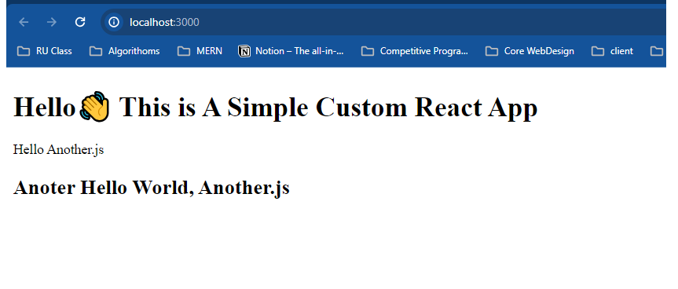

# React Details - Basic Understanding of React

## Install React -  Using CDN ("https://unpkg.com/react@18.2.0/umd/react.production.min.js")

### Client side Rendering procedure of ReactJS
- Ceate a 'root' in HTML file
- React mainly return a Empty HTML file to a response
- then Using JavaScript , Load Component to the HTML 'root'
this is called Client side rendering.
- For browser rendering react use ReactDOM (# CDN -'https://unpkg.com/react-dom@18.2.0/umd/react-dom.production.min.js')

## Bable -  Install Bable Using CDN for using JSX ("https://unpkg.com/babel-standalone@6.26.0/babel.min.js)

### Bable translate JSX to Raw JS code for the Browser. Because Browser doesn't understand JSX .

## Modular Environment : Developer Friendly environment, where developer can code in multiple files. But It will minfie all the code for the User response.

- Crate Modular ENdvironment using Bundeller.
- Example of Bundeller : WebPack , RoolUp(vite)

### Install Rollup

- Global: ```npm install --global rollup```
- Local: ```npm install rollup --save-dev```
- run in cmd : ```rollup main.js --file bundle.js --format esm```
- change HTML in script src ```./main.js``` to ```./bundle.js```

- create ```public``` folder and move ```index.js``` to public folder
- create ```src``` folder and move ```main.js``` & ```another.js```
- crete ```rollup.config.mjs``` file & add this code
    ```
    export default{
        input: 'src/main.js',
        output: {
            file: 'public/bundle.js',
            format: 'esm',
        },
    };
    ```
- run in cmd ``` rollup -c``` - this will manually bundle
- run in cmd ``` rollup -c -w``` - this will automatically bundle when there is any change

## Install React & React DOM

### get error ```bundle.js:1 Uncaught SyntaxError: Cannot use import statement outside a module``` to solve this we need to install rollup pluings ("https://github.com/rollup/plugins")

- install [node-resole](https://github.com/rollup/plugins/tree/master/packages/node-resolve) ``` npm install @rollup/plugin-node-resolve --save-dev ```
- install [commonjs](https://github.com/rollup/plugins/tree/master/packages/commonjs) ``` npm install @rollup/plugin-commonjs --save-dev ```
### get error : ```bundle.js:2793 Uncaught ReferenceError: process is not defined``` it said like that - .env.proces is no defined. 

to solve this install below plugin

- install [replace](https://github.com/rollup/plugins/tree/master/packages/replace) ``` npm install @rollup/plugin-replace --save-dev```
- add to ``` rollup.config.mjs``` 
```
plugins:[nodeResolve(
    ---,
    replace({
        'process.env.NODE_ENV': JSON.stringify('"development"'),
    }),
    ---
)],
```

### now get this error *bundle.js:33269 Uncaught ReferenceError: React is not defined* to solve this add ```import React from 'react'``` to all js file

## Install Bable

- ```npm install --save-dev @babel/core```
- ```npm install --save-dev @babel/preset-react```

### then install rollup pluing for bable

- Install [bable](https://github.com/rollup/plugins/tree/master/packages/babel) ```npm install @rollup/plugin-babel --save-dev```
- 
```
plugins:[
    ---,
    babel({ babelHelpers: 'bundled' , presets: ['@babel/presets-react'], extensions: [".js",'.jsx']}),
    ---,
    ],
```

- install [server](https://www.npmjs.com/package/serve) to serve the application to localhost
- configure package.json 
- 
``` 
scripts: {
"dev": "serve public/",
"build": "rollup -c -w"
},
```

- run cmd ```npm run build```
- run cmd ```npm run dev```

# Final Output:


